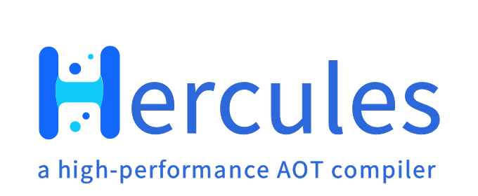

<p align="center">
</img>
</p>

<p align="center">
    <a href="https://hercules-docs.readthedocs.io/en/latest/"><font face="黑体" color=#0099fc size=4>Documentation</font></a>
    <a></a> <font face="黑体" color=#6628ff size=4> &nbsp;.&nbsp; </font></a>
    <a href="https://hercules-docs.readthedocs.io/en/latest/"><font face="黑体" color=#0099fc size=4>文档</font></a>
    <a></a> <font face="黑体" color=#6628ff size=4> &nbsp;.&nbsp; </font></a>
    <a href="CONTRIBUTORS.md"><font face="黑体" color=#0099fc size=4>Contributors</font></a>
    <a></a> <font face="黑体" color=#6628ff size=4> &nbsp;.&nbsp; </font></a>
    <a href="NEWS.md"><font face="黑体" color=#0099fc size=4>Road Map</font></a>
</p>

<br />
&ensp;&ensp;`Hercules`(`HS`) is parts of `EA`(elastic architecture)-`Kumo Search`. The roll of `HS` is to compile `python` and `C/C++` code to `plugin`
library called by the upper layer of business eg. `relevance ranking` in `kumo search` or `timeliness ranking`. `HS` is drive by
`HIR`, another form of mlir, the inputs can be `python` `hs` `c++`, they will be transformed to the `hir`'s unified `AST`. Finally,
transform to ``llvm IR`` compile to a executable program or a `C/C++` callable shared library.

<br />

&ensp;&ensp;Now, ``HS`` is `0.2.x` milestone. The even-numbered version is the exploration version, we try some new features. 
Nonetheless, the current version(`0.2.x`) is very usable.

* ``0.3.x``milestone will complete `dialect` of `c++ interpreter` and, so that ``HS`` can mixed compilation with c++ freely. 
           python using `pybind` using some pyInit* and load module, For Release users’ mental burden, I imagine it 
           should be like this, just give ``HS`` all you `python` and `C++` code, and the `includes` `links` for c++, then,
           ``HS`` give back to you the library or executable program or `jit` it.
            For the purpose, we already write a small tool for project dependencies manage [`carbin`][4], ``carbin``  can
            easy create project with as less knowledge as possible, it doc at [`carbin docs`][5].
* ``0.5.x``milestone will complete `dialect` of `Vectorization optimization` on cpu base on `simd` instructions, for `kumo` ann.
           maybe like `halide`. `gpu` is optional, for ``HS`` functional orientation to `easy business`, not `high performance computing`
* ``0.7.x``milestone we plan to complete `dialect` of `rpc` `networking` schedule on multi thread and fibers environments.
* ``0.9.x``is a big milestone, at this time, we aim to get through ``HS`` call python completely,include call `python`'s
           `pyext`, `whl pakage` directly. Now, we call `python`'s third party module by calling python's run time.
* ``1.x`` after this milestone, we will focus on the upper layer application `plugins`, for example Cluster scheduling, 
          rapid service deployment, solid storage, task of ``NLP``, infer ranking and etc.

## the hercules work flow

<br />

![pic][1]


# try jupyter in docker
<br />


run the following command to start a jupyter notebook server in docker
the password is `123456`

```bash
    docker run -p 8888:8888 lijippy/hs_jupyter:r0.2.7 \
    /usr/local/bin/jupyter notebook --allow-root --ip 0.0.0.0
```

[1]: docs/source/image/flow.webp
[2]: docs/source/image/hercules_img.png
[3]: https://hercules-docs.readthedocs.io/en/latest/
[4]: https://github.com/gottingen/carbin
[5]: https://carbin.readthedocs.io/en/latest/