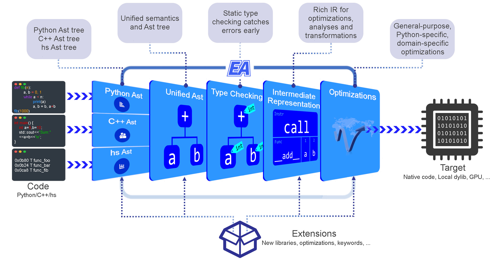

# hercules
aot compiler



[docs](https://hercules-docs.readthedocs.io/en/latest/)

# try jupyter in docker


run the following command to start a jupyter notebook server in docker
the password is `123456`

```bash
    docker run -p 8888:8888 lijippy/hs_jupyter:r0.2.7 \
    /usr/local/bin/jupyter notebook --allow-root --ip 0.0.0.0
```
