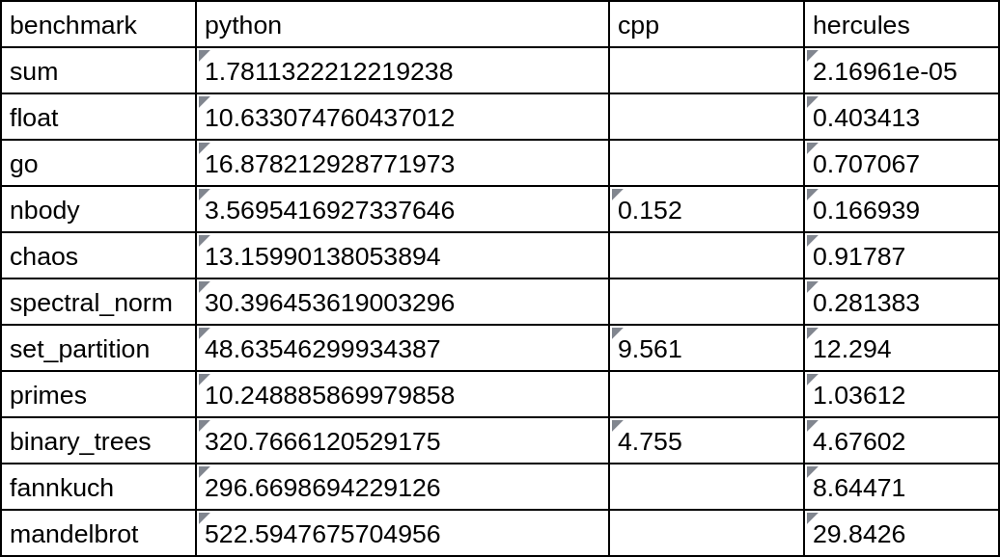
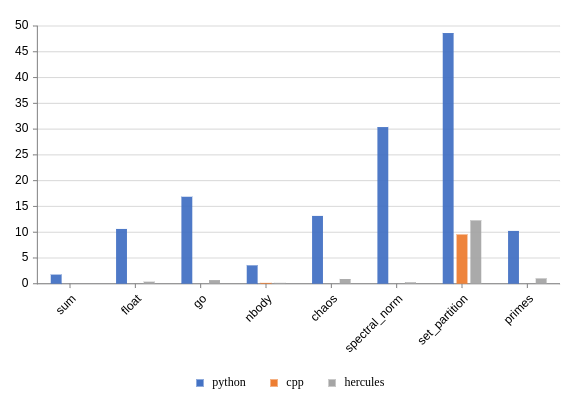

.. Copyright 2024 The Elastic AI Search Authors.
.. Licensed under the Apache License, Version 2.0 (the "License");

..  image:: image/ea_big.png
    :height: 200px
    :width: 240 px
    :scale: 80 %
    :align: center
    :alt: hercules

hercules is a high-performance AOT compiler that compiles Python code to
native machine code or c++ code without any runtime overhead. Typical speedups over
Python are on the order of 100x or more.

..  image:: image/flow.webp
    :align: center
    :alt: hercules

The Hercules framework is fully modular and extensible, allowing for the
seamless integration of new modules, compiler optimizations, domain-specific
languages and so on. We actively work with hercules to interact with Elastic AI Search.

..  image:: image/demo_jupyter.gif
    :align: center
    :alt: hercules

..  image:: image/demo_jupyter.gif
    :align: center
    :alt: hercules

hercules is a high-performance AOT compiler and jit code to run, see the benchmarks below.

Contents
--------

.. toctree::
    :caption: WELCOME TO HERCULES
    :maxdepth: 2

    en/welcome

.. toctree::
    :caption: QUICK STARTED

    en/install
    en/command_line
    en/sneak_peek
    en/jupyter

.. toctree::
    :caption: TUTORIALS

    en/tutorials/foundations
    en/tutorials/collections
    en/tutorials/functions
    en/tutorials/classes
    en/tutorials/types

.. toctree::
    :caption: ADVANCED

    en/ad/integration
    en/ad/export
    en/ad/plugins
    en/ad/ir

.. toctree::
    :caption: Hercules IR

.. toctree::
    :caption: LLVM
    :maxdepth: 2

    en/llvm/introduction
    en/llvm/ir

