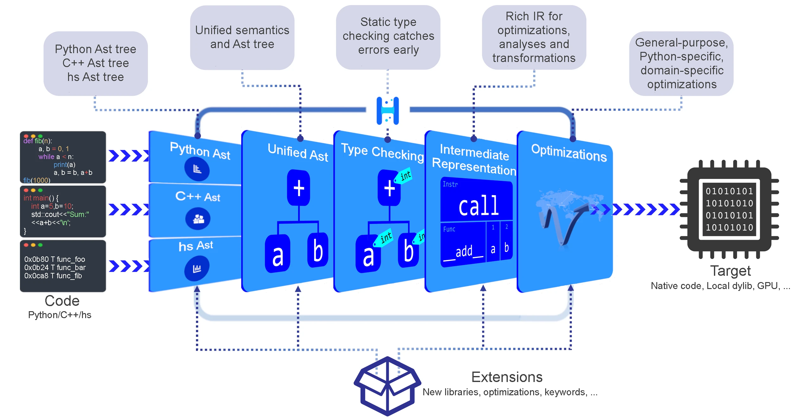

.. Copyright 2024 The Elastic AI Search Authors.
.. Licensed under the Apache License, Version 2.0 (the "License");

..  image:: image/ea_big.png
    :height: 200px
    :width: 240 px
    :scale: 80 %
    :align: center
    :alt: hercules

hercules is a high-performance AOT compiler that compiles Python code to
native machine code or c++ code without any runtime overhead. Typical speedups over
Python are on the order of 100x or more.

The Hercules framework is fully modular and extensible, allowing for the
seamless integration of new modules, compiler optimizations, domain-specific
languages and so on. We actively work with hercules to interact with Elastic AI Search.

Contents
--------

.. toctree::
    :caption: WELCOME TO HERCULES
    :maxdepth: 2

    en/welcome

.. toctree::
    :caption: QUICK STARTED

    en/install
    en/command_line
    en/sneak_peek

.. toctree::
    :caption: TUTORIALS

.. toctree::
    :caption: ADVANCED

.. toctree::
    :caption: TUTORIALS

.. toctree::
    :caption: TIPS

